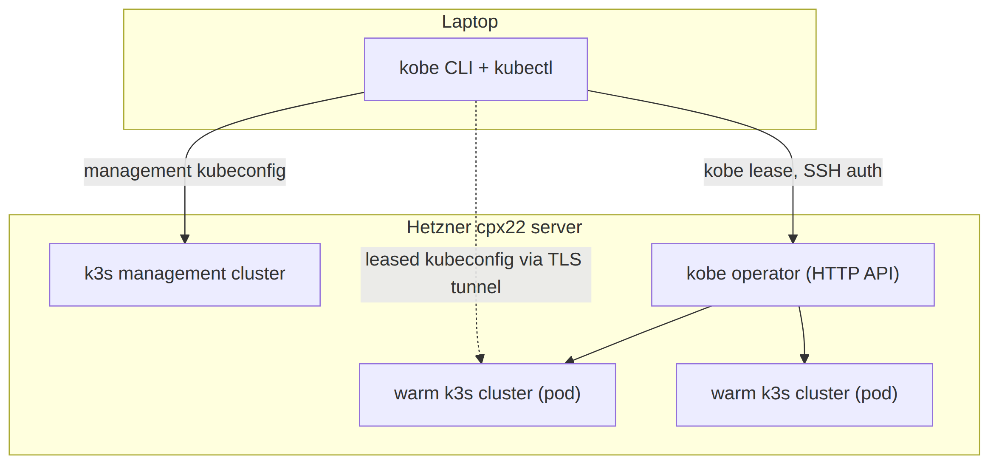
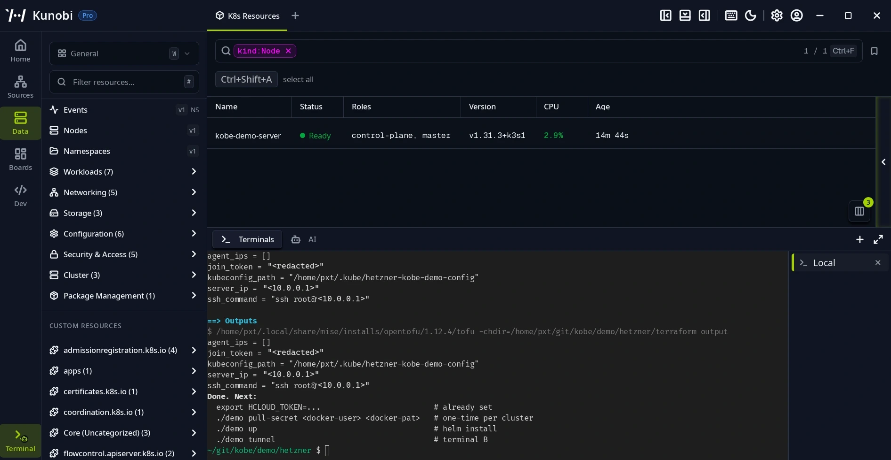
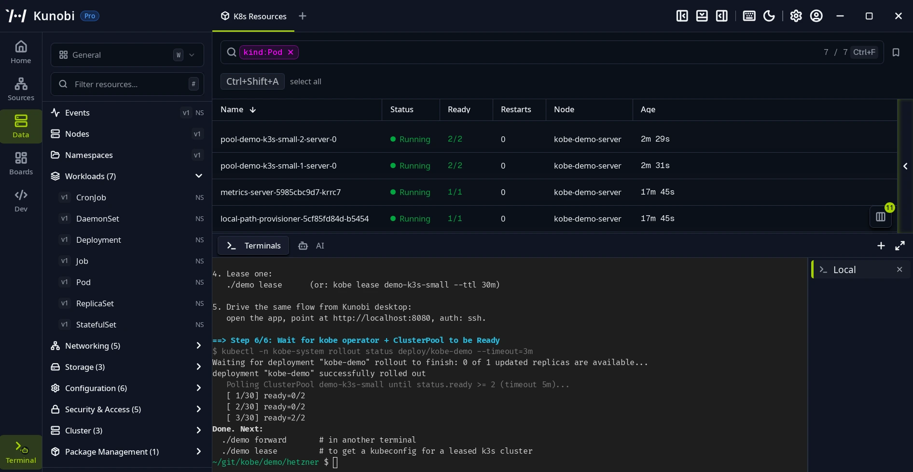
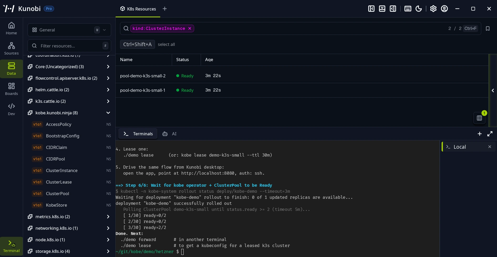
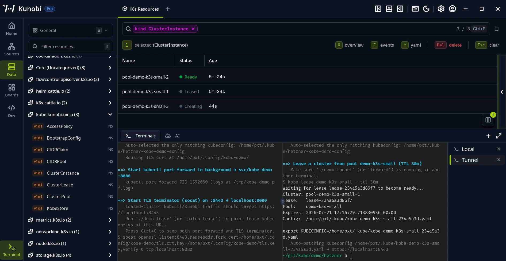
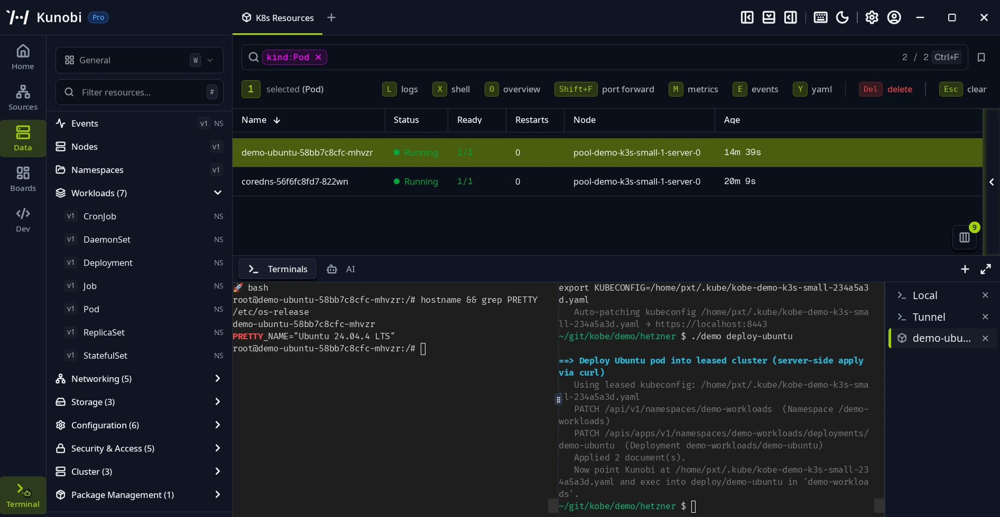
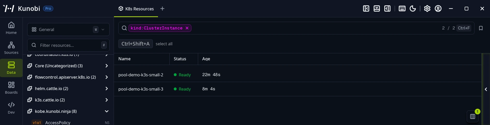

## Introduction

Disposable Kubernetes clusters are one of those problems everyone has and nobody fixes, mostly because waiting "only five minutes" never sounds that bad until you count how many times a day you do it. [kind](https://kind.sigs.k8s.io/) and k3d boot quickly, but they share your machine with everything else. A managed cloud cluster takes about ten minutes to create, and you pay for it as long as the control plane exists. So most teams end up back on one long-lived shared cluster, which is where the leftover namespaces and the "did someone touch staging?" messages come from.

There is a third option, and it is what this tutorial sets up: stop creating clusters on demand and start leasing them from a pool that is already warm. We provision one small [Hetzner Cloud](https://www.hetzner.com/cloud/) server (a cpx22, 2 vCPUs and 4 GB of RAM), run [kobe](https://github.com/kunobi-ninja/kobe) on it, and from then on lease [k3s](https://k3s.io/) clusters from that pool in a few seconds each.

kobe is an Apache-2.0 Kubernetes operator that manages fleets of ephemeral clusters. You declare a pool, the operator keeps a configured number of clusters pre-warmed, and clients lease one over an HTTP API and release it when finished. Released clusters are destroyed rather than reused, and the pool recycles fresh replacements in the background.

By the end of this tutorial you will have one cpx22 server running the kobe operator alongside a pool of two pre-warmed k3s clusters, and a leased cluster with a workload deployed on it.

**Prerequisites**

On your machine you need:

- A Hetzner Cloud project and an [API token](https://docs.hetzner.com/cloud/api/getting-started/generating-api-token) (Read & Write), exported as `HCLOUD_TOKEN`.
- `helm` v3.14+, `kubectl` v1.31+, `socat`, `yq`, and either [OpenTofu](https://opentofu.org/) v1.6+ or Terraform v1.5+.
- An **Ed25519** [SSH keypair](https://community.hetzner.com/tutorials/howto-ssh-key) at `~/.ssh/id_ed25519`. The kobe operator rejects RSA keys.
- The `kobe` CLI. Grab the prebuilt binary for your platform from the [v0.37.0 release](https://github.com/kunobi-ninja/kobe/releases/tag/v0.37.0). For Linux (x86_64):

  ```bash
  curl -sSL https://github.com/kunobi-ninja/kobe/releases/download/v0.37.0/kobe-x86_64-unknown-linux-musl.tar.gz | tar xz
  sudo install kobe /usr/local/bin/
  ```

  (macOS and Windows builds are on the same release page.) Or build from source with `cargo install --path crates/kobectl` if you prefer to use the Rust toolchain.

## Step 1 - How it's put together

The kobe repository contains a [Hetzner demo](https://github.com/kunobi-ninja/kobe/tree/main/demo/hetzner) with two layers. An OpenTofu module provisions a k3s server (with only a single node) on Hetzner Cloud. This server has a private network and a firewall to restrict SSH and the Kubernetes API to your own IP. The kobe operator is then installed from its published Helm chart, and two custom resources are applied on top: a `ClusterPool` that pre-warms two k3s clusters, and an `AccessPolicy` that authenticates the kobe API against your SSH public key. Then there's the demo script, `./demo`, which you can think of as the conductor of the whole operation.



<!--
  Mermaid source for images/architecture.png (rendered to PNG):

  graph TB
    subgraph laptop["Laptop"]
      CLIENT["kobe CLI + kubectl"]
    end
    subgraph server["Hetzner cpx22 server"]
      K3S["k3s management cluster"]
      OP["kobe operator (HTTP API)"]
      C1["warm k3s cluster (pod)"]
      C2["warm k3s cluster (pod)"]
    end
    CLIENT -->|management kubeconfig| K3S
    CLIENT -->|kobe lease, SSH auth| OP
    OP --> C1
    OP --> C2
    CLIENT -.->|leased kubeconfig via TLS tunnel| C1
-->

The "clusters" in the pool are pods on the management cluster. Each warm instance is a complete k3s control plane running in a container, with its own API server and its own state, and it is already running when a lease request arrives. Because the cluster is already up, binding it to a lease is only a matter of seconds.

## Step 2 - Provision the management cluster

Clone the repo:

```bash
git clone https://github.com/kunobi-ninja/kobe
cd kobe/demo/hetzner
```

With the demo directory in place, provisioning is one command:

```bash
export HCLOUD_TOKEN=...   # from console.hetzner.cloud → Security → API Tokens
./demo tf up
```

This takes about 90 seconds: `tofu init` and `apply` create the server, the private network and the firewall, cloud-init installs k3s v1.31.3, and the script fetches a kubeconfig to `~/.kube/hetzner-kobe-demo-config`. When it finishes, point `kubectl` at that kubeconfig for a first look at the cluster: a single Ready node and nothing else.



The kubeconfig uses `insecure-skip-tls-verify: true` because the k3s cert doesn't match the public IP. This is fine for a demo, since the firewall only admits your IP. However, in case you want to keep it, you'll need to give it DNS and cert-manager for a proper certificate.

## Step 3 - Install kobe

The operator ships as a Helm chart published to Docker Hub, which means you can install it from the registry. Then the pool and access policy are two manifests applied on top:

```bash
export KUBECONFIG=~/.kube/hetzner-kobe-demo-config

helm install kobe-demo oci://registry-1.docker.io/zondax/kobe \
  --version 0.37.0 --namespace kobe-system --create-namespace \
  --set replicas=1 --set operatorNamespace=kobe-system

kubectl apply -f ../_shared/manifests/kobe/clusterpool.yaml
SSH_PUBKEY="$(cat ~/.ssh/id_ed25519.pub)" \
  yq '.spec.auth.ssh.authorizedKeys[0] = strenv(SSH_PUBKEY)' \
  ../_shared/manifests/kobe/accesspolicy.yaml | kubectl apply -f -
```

These steps are run by `./demo up`. You'll see you end up with a `kobe-system` namespace containing the operator, the `demo-k3s-small` ClusterPool (sized to keep two clusters warm with a ceiling of three), and the `demo-ssh` AccessPolicy with the public key. The operator deployment comes up first, then two pods appear, each a complete k3s cluster.



kobe's custom resources are plain Kubernetes objects. The `ClusterPool` reports how many instances are warm, and each `ClusterInstance` tracks one of the pods. `./demo status` prints all of them.



## Step 4 - Lease a cluster

The kobe API speaks HTTP inside the cluster, so we first open a tunnel to it. This needs to stay running, so give it its own terminal and leave it alone:

```bash
./demo tunnel
```

Besides the port-forward, the tunnel runs a small proxy that handles HTTPS on `:8443`, which is what lets `kubectl` reach leased clusters later. Then, back in the first terminal, we register the endpoint with the CLI and take a lease:

```bash
kobe config set demo --endpoint http://localhost:8080 --auth ssh
kobe config use demo
./demo lease
```

When you ask for a lease, the CLI signs the request with your Ed25519 key. kobe only accepts it if that key is listed in the AccessPolicy. The first time you connect, the CLI will ask whether you trust the endpoint. After that, a lease comes back (this happens rather quickly because the cluster is already warm). Moreover, you get a kubeconfig file that is already set up to reach the cluster through the tunnel at `https://localhost:8443`. By default, the lease is 30 minutes, and the cluster is freed automatically when that times out.



Point `kubectl` at that kubeconfig and you now have two clusters side by side: the management cluster on Hetzner, and a leased cluster that lives inside it. Over on the management side, the pool has already started replacing the instance we took, so it settles back at two warm clusters.

## Step 5 - Deploy something

```bash
./demo deploy-ubuntu
```

This deploys a small Ubuntu pod into a `demo-workloads` namespace on the leased cluster. Open a shell inside it to confirm the cluster is real:

```bash
kubectl --kubeconfig <leased-kubeconfig> -n demo-workloads exec -it deploy/demo-ubuntu -- bash
```



When we release the lease, this cluster will be destroyed, and the next lease will get a different, fresh instance. There is no cleanup step to run against the cluster itself.

## Step 6 - Release and tear down

```bash
./demo release    # destroy the leased cluster; the pool re-warms
./demo down       # helm uninstall
./demo tf down    # destroy the Hetzner server
```

On release, the leased cluster's pod is deleted and the pool recycles a replacement in the background to get back to two. If you keep the management cluster around, the pool stays warm and you keep leasing from it whenever you need a cluster.



When you are done for good, run `./demo tf down`. The Hetzner server keeps billing for as long as it exists, and uninstalling the chart doesn't remove it, so destroy the server too.

## Conclusion

We've come to the end of the tutorial, and as you have seen, you can now get real Kubernetes clusters in seconds from a server you control. The pool will stay warm in the background, and every lease has an expiry, which means automatic cleanup.

**Next steps:**

* The [kobe repository](https://github.com/kunobi-ninja/kobe) has the full reference, including a troubleshooting section for the known issues.
* Increase `pool.size` in the Helm values to keep more clusters warm, or point CI at the lease API.

##### License: MIT

<!--

Contributor's Certificate of Origin

By making a contribution to this project, I certify that:

(a) The contribution was created in whole or in part by me and I have
    the right to submit it under the license indicated in the file; or

(b) The contribution is based upon previous work that, to the best of my
    knowledge, is covered under an appropriate license and I have the
    right under that license to submit that work with modifications,
    whether created in whole or in part by me, under the same license
    (unless I am permitted to submit under a different license), as
    indicated in the file; or

(c) The contribution was provided directly to me by some other person
    who certified (a), (b) or (c) and I have not modified it.

(d) I understand and agree that this project and the contribution are
    public and that a record of the contribution (including all personal
    information I submit with it, including my sign-off) is maintained
    indefinitely and may be redistributed consistent with this project
    or the license(s) involved.

Signed-off-by: Aleix Raventós <aleix.raventos@zondax.ch>

-->
